Motivation
----------

<a href="https://twitter.com/AshwinRaman_">Ashwin Raman</a> on Twitter
has made percentile rank bar charts quite popular. He also published a
guide to
<a href = "https://thefutebolist.wordpress.com/2018/10/19/a-guide-to-player-comparison-bar-graphs-and-how-i-make-them/">making
your own charts with Tableau and Excel</a>.

This is an implementation of the same with R’s ggplot. Ignore the
cosmetics for now.

Side note: This vs. Radars
--------------------------

This format of demonstrating results is a great improvement over radar
charts. The visual area covered by the bars is a more reliable measure
of the quality of a player than the visual area covered by radars. Since
radars are arranged in a circular manner, the same sort of percentiles
could look very different based on the order of the values.

Here are three radars of the same set of percentiles, just that the
order of the metrics has been changed -

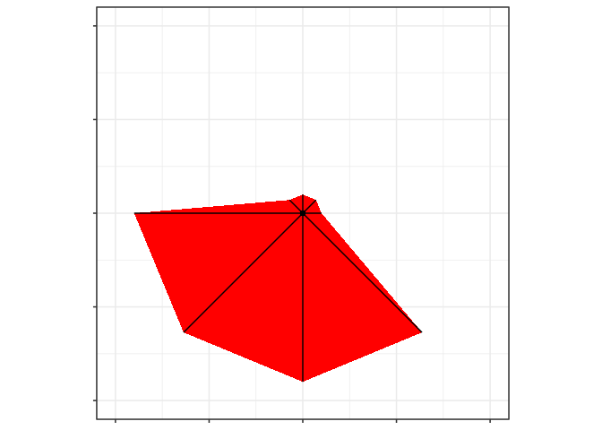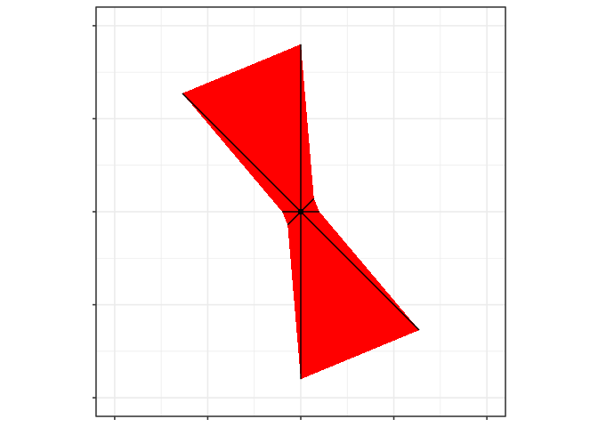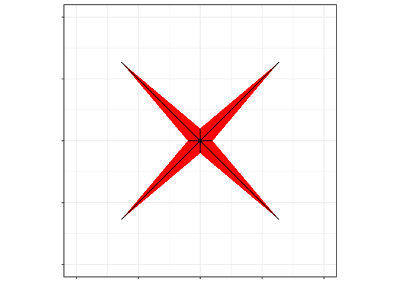

See how different they look? Stop using radars, folks. They look cool
but they don’t work well.

Random Dataset
--------------

First I generate a dataset of random metrics to demonstrate my code -

<table>
<thead>
<tr class="header">
<th style="text-align: left;">PlayerName</th>
<th style="text-align: right;">StatUniform</th>
<th style="text-align: right;">StatLeftSkew</th>
<th style="text-align: right;">StatRightSkew</th>
<th style="text-align: right;">StatVeryLeftSkew</th>
<th style="text-align: right;">StatVeryRightSkew</th>
</tr>
</thead>
<tbody>
<tr class="odd">
<td style="text-align: left;">A A</td>
<td style="text-align: right;">0.2655087</td>
<td style="text-align: right;">0.9406492</td>
<td style="text-align: right;">9.909544</td>
<td style="text-align: right;">0.0568283</td>
<td style="text-align: right;">9.604152</td>
</tr>
<tr class="even">
<td style="text-align: left;">A B</td>
<td style="text-align: right;">0.3721239</td>
<td style="text-align: right;">0.1158253</td>
<td style="text-align: right;">9.843509</td>
<td style="text-align: right;">0.1696023</td>
<td style="text-align: right;">6.701396</td>
</tr>
<tr class="odd">
<td style="text-align: left;">A C</td>
<td style="text-align: right;">0.5728534</td>
<td style="text-align: right;">0.8149687</td>
<td style="text-align: right;">9.262688</td>
<td style="text-align: right;">2.4876168</td>
<td style="text-align: right;">9.932769</td>
</tr>
<tr class="even">
<td style="text-align: left;">A D</td>
<td style="text-align: right;">0.9082078</td>
<td style="text-align: right;">0.2422635</td>
<td style="text-align: right;">9.798659</td>
<td style="text-align: right;">0.6356492</td>
<td style="text-align: right;">9.888021</td>
</tr>
<tr class="odd">
<td style="text-align: left;">A E</td>
<td style="text-align: right;">0.2016819</td>
<td style="text-align: right;">1.4250984</td>
<td style="text-align: right;">8.897823</td>
<td style="text-align: right;">1.2017351</td>
<td style="text-align: right;">7.963193</td>
</tr>
<tr class="even">
<td style="text-align: left;">A F</td>
<td style="text-align: right;">0.8983897</td>
<td style="text-align: right;">0.3659411</td>
<td style="text-align: right;">9.983252</td>
<td style="text-align: right;">0.0950543</td>
<td style="text-align: right;">6.241721</td>
</tr>
</tbody>
</table>

( Bear with the funny column names for now. )

And now I draw charts for the player named, A A.

Here’s code that recreates the original design -

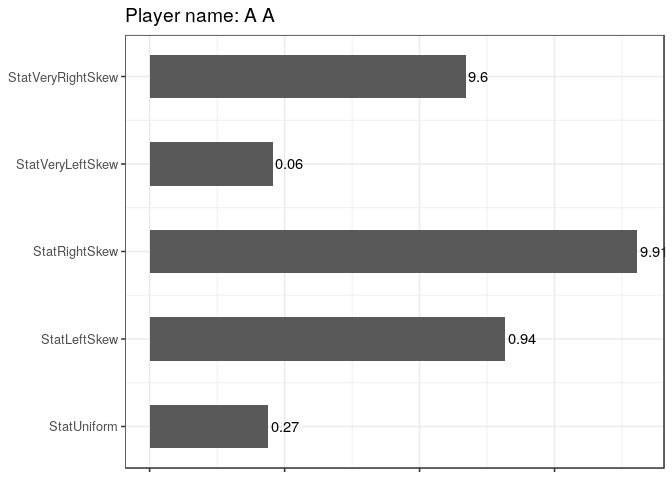

Improvement
-----------

The only complaint I’ve had with this design is that by showingo only
percentiles, the underlying distribution is completely lost. Let me
demonstrate, and that’s why the funnily named columns -

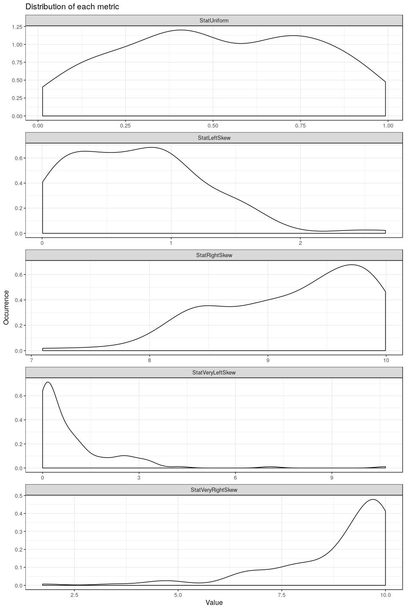

Note how the StatUniform values are nicely spread out across the X axis
but the other four stats are all lumped towards one end or the other.
When we take percentiles of these metrics and plot them against the
actual value that percnetile corresponds to, here’s what we get -

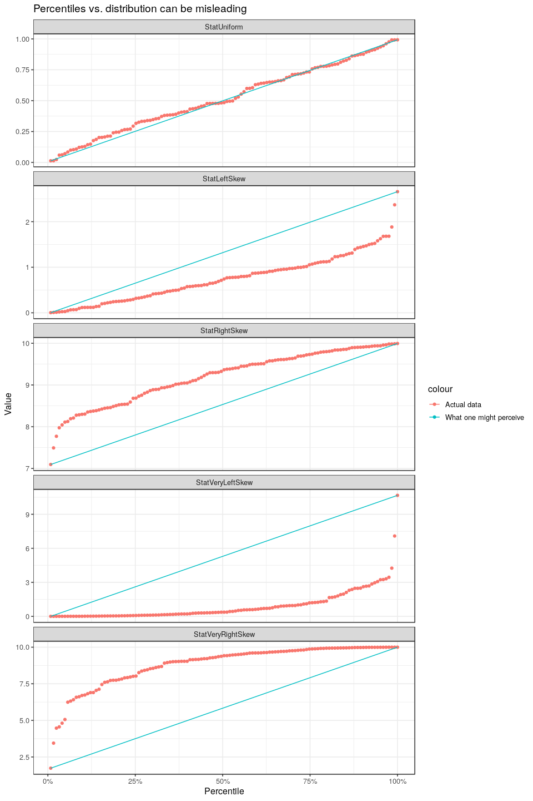

Percentiles just pick a value which has a certain proportion of the data
below it. If your data is fairly uniformly distributed, i.e. there is an
equal probability of encountering any value within the spectrum of
possible values, then a percentile does the job fine. However, when your
data is skewed, i.e. you may encounter lower values more often than
higher values or vice versa, then a percentile can be misleading.

In the second plot, the blue line adds a reference for what absolute
value you might perceive the respective percentile is indicating. The
gap in your persepctive and actual data is the gap between the red point
and the blue line at that percentie. For instance, in any of the left
skewed metrics, the 75th percentile as an absolute number is quite far
from the best and much closer to the worst in fact. Conversely, the 25th
percentile in the right skewed metrics, as an absolute value isn’t as
far from the best as the percentile might suggest. However, for
StatUniform, they are never too far apart.

Enhancements
------------

With the designs below, I try to solve this problem as well.

This player’s StatVeryRightSkew is almost equal to the best value
observed, even though it’s only at around 60 percentile. All the other
skewed columns also hae a similar issue. We will try and have some
visual indicator to clear that up.

### Design 2

Add absolute values along the bar for each stat -

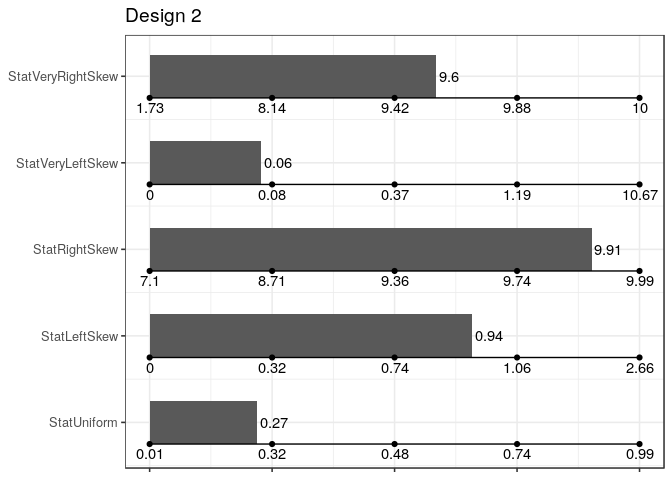

### Design 3

Overlay a miniature distribution on the bar for the respective stat -

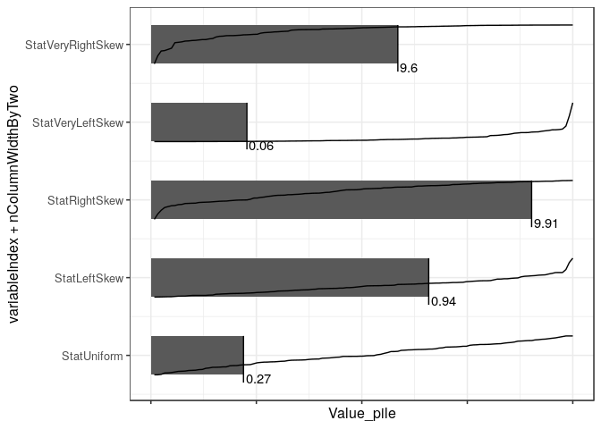

And can add labels to the distribution if you want.

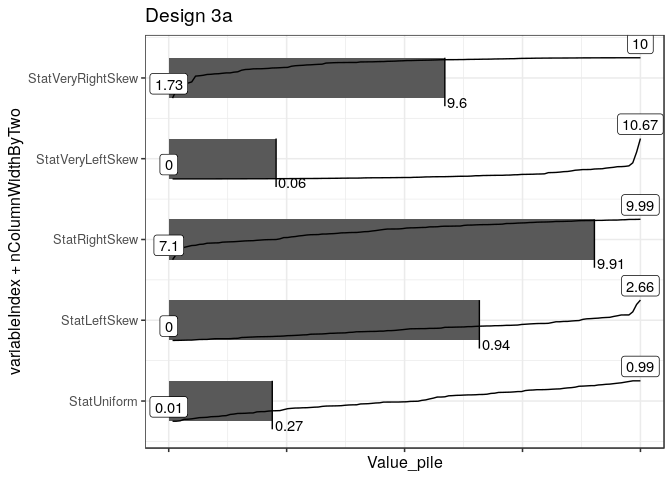

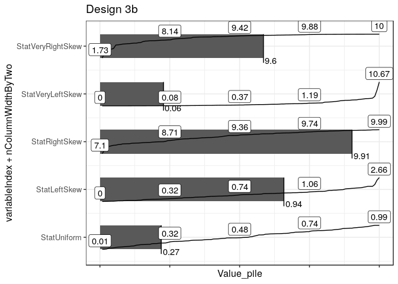

### Design 4

Within the bar, place the label at a point that indicates where it lies
with respect to the absolute values. Can again choose to omit the labels
or have the labels for the best and worst values.

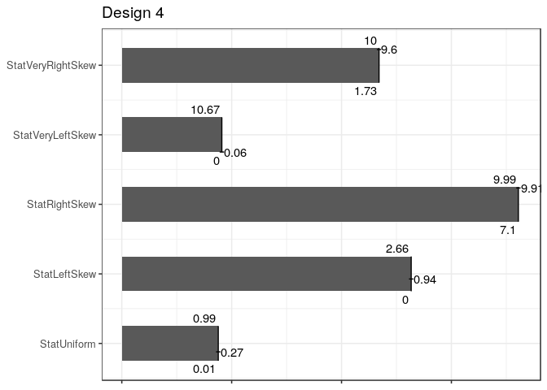

Why Not Colours or Size?
------------------------

Two other options that you could use to solve this problem: - We could
have used colours to have a gradient over the bar, where the gradient is
derived from the absolute value. - We could have put the label in a
particular colour.

By throwing colour into the mix, the visual indicator of the area
covered by the bars is messed with and the viewer is now forced to
perceive size and colour both. The biggest advantage this design offers
radars is then diluted. It would also look really complex and ugly with
so many colours all over the place. That’s why I chose to keep the
single shade that Ashwin Raman originally used and only add labels or
lines.

Make your own
-------------

I’ve added code in the Script.R file in the same Github repository for
you to create your own charts from the original templates. If you have
suggestions, feedback, etc. please find
<a href="twitter.com/thecomeonman">me on Twitter</a>. I will wait for a
few days, in case there are any suggestions and then package this in a
way that it’s more easily reusable than now and looks better visually.

You will need to install R and Rstudio from
<a href="https://cran.r-project.org" class="uri">https://cran.r-project.org</a>
and
<a href="https://www.rstudio.com/products/rstudio/download/" class="uri">https://www.rstudio.com/products/rstudio/download/</a>
respectively. Once installed, open Rstudio and run the following command
in the console - `install.packages('data.table','ggplot2','scales')` and
you should be good to run the script. Follow the instructions and paste
all the lines of code in your console to run it. Feel free to get in
touch if you’re stuck.
